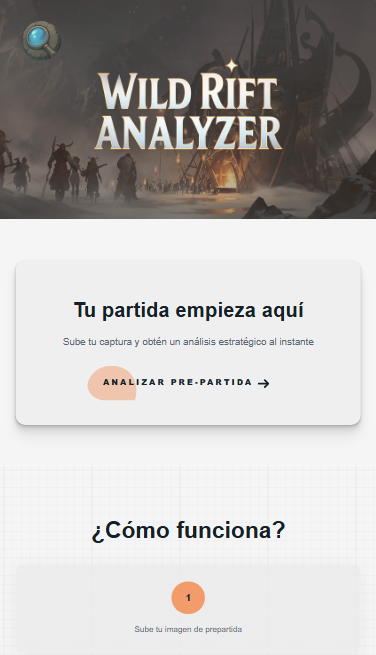
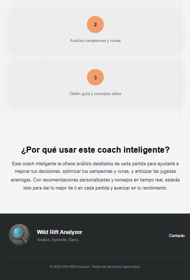
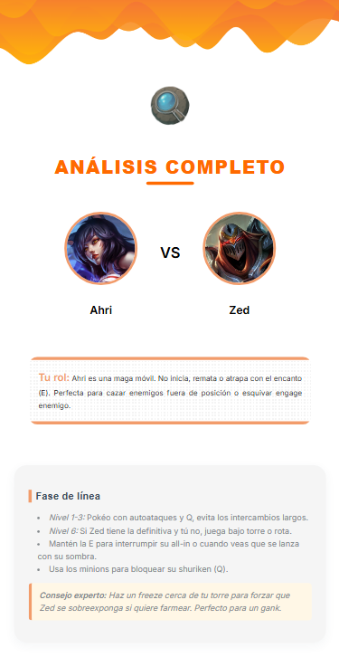
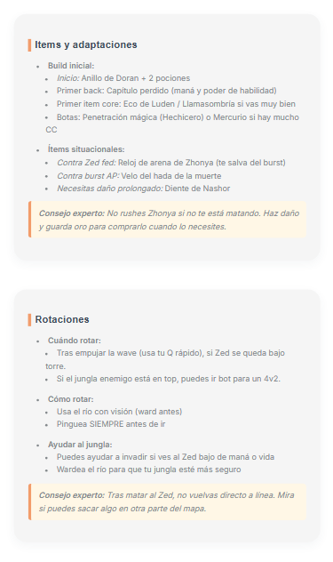
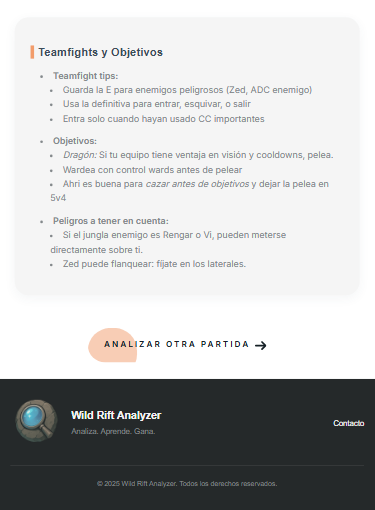

# WRAnalyzer Frontend

🎮 **WRAnalyzer** es una aplicación web diseñada para analizar partidas del juego **League of Legends: Wild Rift**.  
Este repositorio contiene **el frontend de la app**, desarrollado con enfoque en diseño moderno, UI intuitiva y experiencia de usuario.

---

## ✨ Sobre el proyecto

Este proyecto fue un encargo freelance de diseño y desarrollo de la interfaz.  
La idea principal era crear una plataforma donde los jugadores de **Wild Rift** pudieran subir una **captura de pantalla de su partida** y recibir un análisis automático, con recomendaciones personalizadas para mejorar su rendimiento.

Entre las funcionalidades previstas estaban:

- Analizar partidas a partir de capturas de pantalla.
- Ofrecer consejos personalizados sobre:
  - Builds recomendadas.
  - Rotaciones efectivas.
  - Participación en teamfights.
  - Mejora del micro y macro game.
- Incluir sugerencias extra de parte de expertos para ayudar a los jugadores a progresar en el juego.

---

## 🎨 Tecnologías usadas

- HTML5  
- CSS3    
- Angular  
- Miro 
- Notion

---

## 📸 Capturas

## 👩🏻‍🎨 Autora (yo)

💼 Desarrolladora web con enfoque en diseño UI/UX y frontend
📌 Portfolio: [Conóceme aquí!](https://portfolio-aikarubi.netlify.app/)
📧 Contacto: [aikarubiresponde@gmail.com]

## ⚠️ Nota

Este proyecto no está activo ni en producción.
Se presenta como parte de mi experiencia en diseño y desarrollo frontend.

